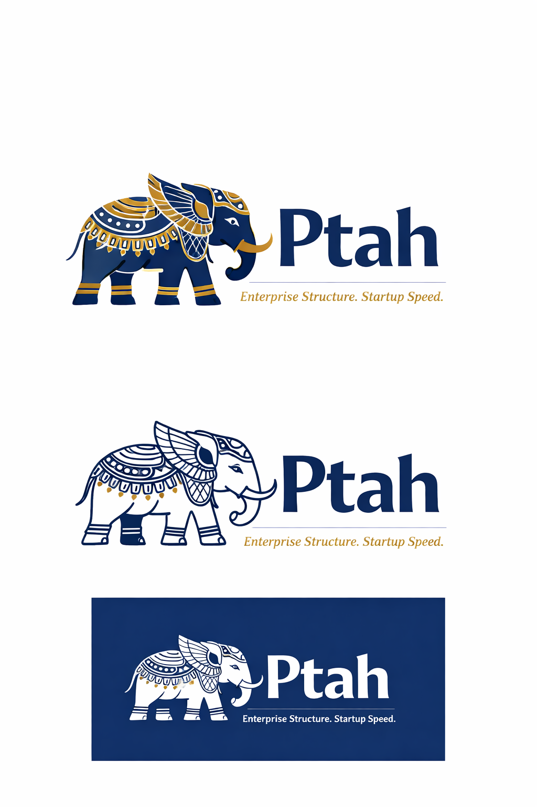

<div align="center">
  

  <h3>Enterprise Structure. Startup Speed.</h3>

  <p>
    Um sistema pequeno, do zero à produção, em minutos.<br>
    Com IA, ainda mais rápido — e gastando muito menos tokens.
  </p>
</div>

[](https://php.net)
[](https://laravel.com)
[](https://livewire.laravel.com)
[](https://tailwindcss.com)
[](LICENSE)

---

## O que é o Ptah?

**Ptah** é um pacote Laravel que combina scaffolding SOLID, componentes visuais prontos e um sistema de CRUD dinâmico em uma única instalação. Com um comando você gera toda a estrutura de uma entidade — model, migration, DTO, repositório, service, controller, requests, resource, view Livewire e rotas — pronta para uso desde o primeiro `php artisan serve`.

| Pilar | O que entrega |
|---|---|
| **Ptah Forge** | 26 componentes Blade (`<x-forge-*>`) com Tailwind v4 + Alpine.js — layout, sidebar, navbar, modal, tabela, formulários e muito mais |
| **ptah:forge** | Gerador de scaffolding SOLID: uma entidade inteira em segundos, com arquitetura em camadas e stubs customizáveis |
| **BaseCrud** | Tela Livewire completa gerada automaticamente — filtros, modal create/edit, soft delete, exportação e preferências por usuário, tudo configurável via banco de dados |

---

## ⚡ Do zero à produção em minutos

> Com **ptah + IA** (GitHub Copilot, Claude, Cursor) você gasta uma fração dos tokens necessários para construir o mesmo sistema do zero — porque o pacote já entrega a estrutura, e a IA só precisa preencher as regras de negócio específicas.

### Exemplo: Helpdesk de TI — sistema completo em ~3 minutos

```bash
# 1. Projeto Laravel + ptah instalado (ptah:install já rodou)
php artisan ptah:module auth
php artisan ptah:module permissions
php artisan ptah:module menu

# 2. Gerar as 3 entidades do sistema
php artisan ptah:forge Category \
  --fields="name:string,color:string:nullable,description:text:nullable"

php artisan ptah:forge Agent \
  --fields="name:string,email:string,department_id:unsignedBigInteger:nullable"

php artisan ptah:forge Ticket \
  --fields="title:string,description:text,status:string,priority:string,category_id:unsignedBigInteger,agent_id:unsignedBigInteger:nullable,resolved_at:datetime:nullable"

# 3. Rodar migrations e servir
php artisan migrate
php artisan serve
```

**O que você tem ao final:**

- ✅ Login com proteção de sessão e 2FA
- ✅ CRUD completo de Categorias, Agentes e Chamados — tabela, filtros, modal, soft delete, exportação
- ✅ Controle de acesso por role (MASTER + roles customizáveis)
- ✅ Menu lateral dinâmico
- ✅ Arquitetura SOLID: Controller → Service → Repository → DTO
- ✅ Validações, Resources e rotas RESTful geradas
- ✅ 14 artefatos criados por entidade, zero boilerplate manual

**Com IA:** em vez de a IA gerar centenas de arquivos — consumindo milhares de tokens e com alta chance de inconsistência arquitetural —, ela executa os comandos acima e preenche apenas a lógica específica do negócio: escalation de chamados, notificações por prioridade, integrações externas. O ptah resolve a estrutura; a IA resolve o diferencial.

---

## 🚀 Instalação

```bash
# 1. Instalar o pacote
composer require jonytonet/ptah

# 2. Rodar o instalador
php artisan ptah:install

# 3. (Opcional) Instalar Laravel Boost para integração com agentes de IA
php artisan ptah:install --boost
```

> Consulte o **[guia de instalação completo →](docs/InstallationGuide.md)** para configuração do banco de dados, módulos opcionais e solução de problemas.

---

## 🧩 Módulos opcionais

Ative apenas o que precisar. Cada módulo atualiza o `.env` e roda suas próprias migrations.

| Módulo | Comando | O que ativa |
|---|---|---|
| **auth** | `php artisan ptah:module auth` | Login, logout, recuperação de senha, 2FA (TOTP + e-mail), perfil, sessões ativas |
| **menu** | `php artisan ptah:module menu` | Menu lateral dinâmico via banco de dados com cache, grupos accordion |
| **company** | `php artisan ptah:module company` | Gestão de empresas e departamentos, company switcher, suporte multi-tenant |
| **permissions** | `php artisan ptah:module permissions` | RBAC completo — roles, páginas, objetos, middleware, Blade directives, auditoria |
| **api** | `php artisan ptah:module api` | REST API com Swagger/OpenAPI via `darkaonline/l5-swagger`, `BaseResponse` padronizada |

```bash
# Ver estado atual de todos os módulos
php artisan ptah:module --list
```

---

## 🤖 Ptah + IA

Ptah foi projetado para trabalhar com agentes de IA. Ao instalar com `--boost`, o pacote registra automaticamente suas guidelines nos agentes configurados (GitHub Copilot, Claude, Cursor, Gemini, etc.), dando ao agente conhecimento profundo sobre convenções, comandos e arquitetura do ptah.

**Por que isso importa:**

- **Sem ptah:** a IA precisa gerar model + migration + repository + service + controller + requests + resource + view + rotas para cada entidade — dezenas de arquivos, milhares de tokens, alta chance de inconsistência
- **Com ptah:** a IA executa `ptah:forge MinhaEntidade --fields="..."` e o sistema está pronto — poucos tokens, arquitetura garantida pelo pacote

> Para prompts, templates e fluxo de trabalho com IA, veja o **[Guia de IA →](docs/AI_Guide.md)**

---

## 📟 Comandos

| Comando | Descrição |
|---|---|
| `php artisan ptah:install` | Instala o pacote (config, stubs, migrations, dados padrão). Flags: `--demo`, `--boost`, `--force`, `--skip-npm` |
| `php artisan ptah:forge {Entity}` | **Gera a estrutura completa de uma entidade** ⭐ |
| `php artisan ptah:module {módulo}` | Ativa módulo opcional |
| `php artisan ptah:module --list` | Lista módulos e estados |
| `php artisan ptah:docs {Entity}` | Gera anotações Swagger/OpenAPI |

---

## 📚 Documentação

| Documento | Conteúdo |
|---|---|
| **[Installation Guide](docs/InstallationGuide.md)** | Passo a passo completo com output real do terminal — Laravel 11/12, todos os módulos e Boost |
| **[BaseCrud](docs/BaseCrud.md)** | Referência completa — schema de colunas, tipos, filtros, renderers, exportação, preferências e configuração via UI |
| **[Modules](docs/Modules.md)** | Documentação detalhada dos módulos Auth, Menu, Company, Permissions e API |
| **[Company](docs/Company.md)** | Módulo Company — empresas, departamentos, company switcher e multi-empresa |
| **[Permissions](docs/Permissions.md)** | Módulo Permissions — RBAC, roles, middleware, helpers, Blade directives e auditoria |
| **[Base Layer](docs/BaseLayer.md)** | BaseDTO, BaseRepository, BaseService — todos os métodos, assinaturas, exemplos e parâmetros de query da API REST |
| **[AI Guide](docs/AI_Guide.md)** | Integração com agentes de IA — prompts, templates e workflow com Copilot, Claude e Cursor |

---

## 📋 Requisitos

| Requisito | Versão mínima |
|---|---|
| PHP | 8.2 |
| Laravel | 11 ou 12 |
| Node.js + npm | 18+ |
| Livewire | v4 (incluso como dependência) |

---

## 📄 Licença

Open source sob a [Licença MIT](LICENSE).

---

<div align="center">
  <p>Feito por <a href="https://github.com/jonytonet">jonytonet</a></p>
  <p><em>Ptah — Enterprise Structure. Startup Speed.</em></p>
</div>
